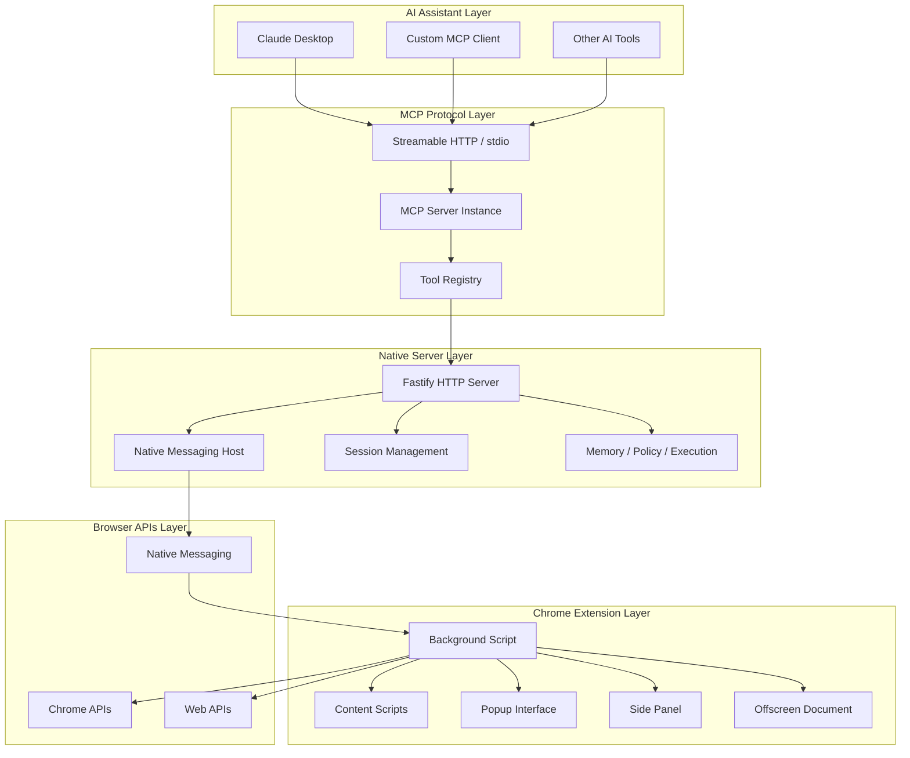

# Tabrix Architecture

This document provides a technical overview of the Tabrix codebase architecture and major runtime paths.

Scope note:

- The stable public product surface is centered on the Chrome extension browser runtime plus MCP access through `Streamable HTTP` and `stdio`.
- Legacy semantic-indexing, agent, workflow, local-model, and WASM acceleration subsystems are not part of the current public product surface.

## Overview

Tabrix is a browser automation platform that bridges AI assistants with Chrome browser capabilities through the Model Context Protocol (MCP). The architecture is designed for:

- **Extensibility**: modular tool schemas and browser-side executors
- **Reliability**: explicit bridge status, diagnostics, and recovery paths
- **Security**: local-first execution, tool risk tiers, and opt-in gates for high-risk tools
- **Observability**: runtime events, Memory records, and release gates for verifiable behavior

## System Architecture



## Component Details

### Native Server (`app/native-server/`)

**Purpose**: MCP transport implementation, Native Messaging bridge, policy enforcement, and local persistence.

Key components:

- **Fastify HTTP Server**: hosts MCP over `Streamable HTTP`, status, auth, recovery, Memory read routes, and diagnostics.
- **Native Messaging Host**: communicates with the Chrome extension.
- **MCP Tool Registry**: publishes tool schemas from `@tabrix/shared` and forwards browser tool calls to the extension.
- **MKEP Runtime**: Memory persistence, Experience query/replay support, Policy gates, execution tracking, and v2.7 browser observation state.

### Chrome Extension (`app/chrome-extension/`)

**Purpose**: browser-side execution runtime.

Key components:

- **Background Runtime**: initializes the native-host bridge and mounts browser tool executors.
- **Browser Tools**: navigation, click/fill, keyboard, screenshot, network capture, page reading, dialog/download handling, and guarded high-risk actions.
- **Knowledge Layer**: registry and lookup helpers that support page-role and high-value-object classification.
- **Popup / Side Panel**: connection status, remote access controls, and MKEP placeholder or read surfaces.
- **Inject Scripts**: page-context helpers for interaction, observation, screenshots, and DOM extraction.

### Shared Package (`packages/shared/`)

**Purpose**: stable cross-process contract between the native server, Chrome extension, tests, and downstream MCP clients.

Primary surfaces:

- `tools.ts`: MCP tool names, schemas, risk tiers, opt-in metadata, and capability gates.
- `bridge-ws.ts`: extension-to-native bridge message protocol.
- `read-page-contract.ts`: `chrome_read_page` output contract, HVOs, candidate actions, layer routing, and stable target refs.
- `memory.ts`, `experience.ts`, `choose-context.ts`: MKEP read-side DTOs and shared constants.
- `capabilities.ts`, `click.ts`, `execution-value.ts`: shared policy, action-outcome, and execution-value primitives.

## Data Flow

### Tool Execution

```text
AI assistant
  -> MCP transport (Streamable HTTP / stdio)
  -> native-server tool registry
  -> Native Messaging bridge
  -> Chrome extension background tool executor
  -> Chrome / Web APIs
  -> normalized MCP result
```

### Runtime Observation

```text
Chrome extension observers
  -> shared bridge observation message
  -> native-server v2.7 runtime state
  -> data-source router / chooser / Memory evidence
  -> MCP result annotations or follow-up routing decisions
```

## Performance Optimizations

- **Transport boundaries**: the native server keeps MCP session and policy work local, while browser actions stay in the extension where Chrome APIs are available.
- **Layered page reading**: `chrome_read_page` emits compact task layers, high-value objects, candidate actions, and stable target refs to reduce repeated full-page reads.
- **Policy-time filtering**: high-risk tools are hidden or denied before dispatch when the operator has not opted in.
- **Release gates**: benchmark and readiness checks protect public contract drift without requiring private browser evidence in public CI.

## Extension Points

### Adding New Tools

1. Define the schema and risk tier in `packages/shared/src/tools.ts`.
2. Implement the browser executor in `app/chrome-extension/entrypoints/background/tools/browser/`.
3. Register the executor in the browser tool index.
4. Add deterministic tests for schema, policy, and executor behavior.

### Protocol Extensions

1. Add cross-process types in `packages/shared` first.
2. Keep native-server runtime logic under `app/native-server`.
3. Keep Chrome API and DOM interaction logic under `app/chrome-extension`.
4. Update docs and release gates when a public contract changes.

This architecture enables Tabrix to deliver browser automation through a local MCP bridge while maintaining security, observability, and extensibility.
