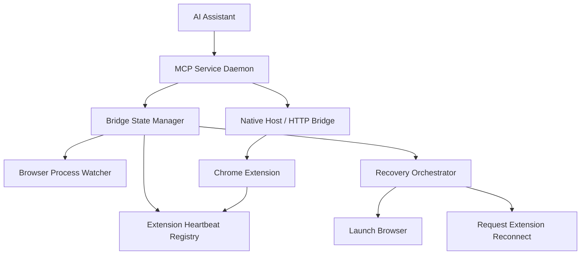
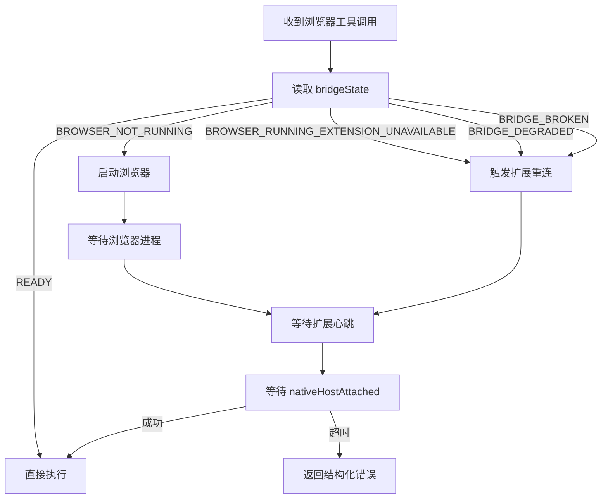

# Tabrix 浏览器桥接状态机与自动恢复实施设计（2026Q2）

## 1. 目标

本设计用于把 Tabrix 当前“本地 MCP 服务 + 浏览器扩展 + Native Host”之间的连接链路，从临时探测和失败后重试，升级为产品级的连接管理系统。

核心目标：

1. 让 MCP 服务长期维护一份可信的浏览器桥接状态，而不是在每次工具调用时临时猜。
2. 让 AI 助手在发起浏览器自动化任务时，能先拿到明确状态，再决定直接执行、自动恢复、还是提示用户处理。
3. 让“浏览器未运行”“扩展未连接”“扩展未安装/已禁用”“Native Host 注册异常”“桥接恢复超时”这些情况被准确区分。
4. 保持 Tabrix 的产品定位：接管用户原生浏览器，同时尽量做到低打扰、低痕迹、低误判。

## 2. 非目标

本轮设计不包含：

1. 新增第三种正式 transport。当前仍只支持 `stdio` 和 `Streamable HTTP`。
2. 自动偷偷启动浏览器。只有在收到浏览器自动化任务时，才允许按需拉起浏览器。
3. 用 AI 助手会话脚本来掩盖产品状态问题。状态机必须由 MCP 服务本身维护。

## 3. 当前现状与问题

### 3.1 已有基础

当前项目已经具备以下能力：

1. 常驻 daemon：`tabrix daemon start|stop|status`
2. 安装后 best-effort 启动 daemon
3. 浏览器 Native Messaging Host 注册机制
4. 扩展侧 auto-connect / reconnect 基础逻辑
5. MCP 服务侧桥接恢复雏形：浏览器工具失败时可尝试恢复一次
6. 浏览器进程探测与 best-effort 启动 Chrome 的代码

### 3.2 当前主要问题

1. 状态分散
   - daemon 状态、nativeHostAttached、扩展连接状态、浏览器进程状态没有统一建模。
2. 状态误判
   - 某些时候“服务在线”不等于“浏览器自动化可用”。
3. 恢复逻辑不成体系
   - 当前更像失败后补救，而不是标准状态机驱动。
4. 用户体验不稳定
   - AI 助手可能已经连上 MCP 服务，但 MCP 服务仍未真正连上浏览器扩展。
5. 缺少扩展心跳
   - 服务端无法明确知道“扩展还活着、只是暂时忙”还是“扩展根本没连上”。

## 4. 设计原则

1. 状态先于动作
   - 所有浏览器自动化动作前，先读取桥接状态。
2. 先观察，后恢复
   - 不要一收到异常就乱拉浏览器、乱重连。
3. 按需启动浏览器
   - 没收到浏览器自动化任务前，不主动启动浏览器。
4. 区分“服务在线”和“浏览器自动化可用”
   - 这是两个不同层次的状态。
5. MCP 服务为真相源
   - 浏览器桥接状态统一保存在 MCP 服务侧。
6. 错误码结构化
   - 让 AI 助手可以准确转述给用户，而不是泛泛一句“连接失败”。

## 5. 总体架构



## 6. 状态模型

### 6.1 顶层状态

新增统一桥接状态 `bridgeState`：

- `READY`
- `BROWSER_NOT_RUNNING`
- `BROWSER_RUNNING_EXTENSION_UNAVAILABLE`
- `BRIDGE_CONNECTING`
- `BRIDGE_DEGRADED`
- `BRIDGE_BROKEN`

### 6.2 状态含义

#### `READY`

满足以下全部条件：

1. 检测到浏览器进程存在
2. 最近心跳未超时
3. Native Host / 扩展桥接可通信
4. 浏览器自动化工具可执行

#### `BROWSER_NOT_RUNNING`

1. 服务在线
2. 未检测到 Chrome/Chromium 进程
3. 未收到有效扩展心跳

#### `BROWSER_RUNNING_EXTENSION_UNAVAILABLE`

1. 检测到浏览器进程存在
2. 但心跳过期或不存在
3. 说明浏览器开着，但扩展未安装/未启用/未连接/Service Worker 未恢复

#### `BRIDGE_CONNECTING`

1. 正在进行恢复动作
2. 包括：等待扩展连上、等待浏览器启动、等待 bridge attach

#### `BRIDGE_DEGRADED`

1. 最近一段时间出现过中断
2. 但短时间内又恢复了
3. 用于提示“当前可用，但不稳定”

#### `BRIDGE_BROKEN`

1. 自愈尝试已执行
2. 仍未恢复到 `READY`
3. 需要用户干预

### 6.3 服务端状态结构

建议新增统一状态对象：

```ts
interface BridgeRuntimeState {
  bridgeState:
    | 'READY'
    | 'BROWSER_NOT_RUNNING'
    | 'BROWSER_RUNNING_EXTENSION_UNAVAILABLE'
    | 'BRIDGE_CONNECTING'
    | 'BRIDGE_DEGRADED'
    | 'BRIDGE_BROKEN';
  browserProcessRunning: boolean;
  browserProcessDetectedAt: number | null;
  extensionInstalledKnown: boolean | null;
  extensionHeartbeatAt: number | null;
  extensionConnectionId: string | null;
  nativeHostAttached: boolean;
  lastBridgeReadyAt: number | null;
  lastBridgeErrorCode: string | null;
  lastBridgeErrorMessage: string | null;
  lastRecoveryAction: string | null;
  lastRecoveryAt: number | null;
  recoveryAttempts: number;
  recoveryInFlight: boolean;
}
```

## 7. 扩展心跳设计

### 7.1 心跳目标

让 MCP 服务明确知道：

1. 扩展当前是否活着
2. 扩展是否已连接 native host
3. 浏览器自动化是否大概率可用

### 7.2 心跳频率

建议：

- 扩展每 `5s` 发送一次 heartbeat
- 服务端 `15s` 未收到则判定过期

理由：

1. 5 秒足够及时
2. 对扩展和服务端压力很低
3. 15 秒容忍短时 Service Worker 抖动

### 7.3 心跳载荷

扩展 -> MCP 服务：`POST /bridge/heartbeat`

```json
{
  "extensionId": "njlidkjgkcccdoffkfcbgiefdpaipfdn",
  "connectionId": "uuid-or-seq",
  "sentAt": 1776200000000,
  "nativeConnected": true,
  "browserVersion": "Chrome 135",
  "tabCount": 8,
  "windowCount": 2,
  "autoConnectEnabled": true
}
```

### 7.4 心跳返回

服务端返回：

```json
{
  "ok": true,
  "bridgeState": "READY",
  "serverTime": 1776200001234,
  "nextHeartbeatInMs": 5000
}
```

## 8. 浏览器进程观察器

### 8.1 目标

MCP 服务侧独立维护“浏览器是否在运行”。

### 8.2 观察策略

1. 平时每 `10s` 轻量检测一次浏览器进程
2. 当心跳过期时，立即补一次检测
3. 当收到浏览器自动化任务时，立即补一次检测

### 8.3 不应做的事

1. 不因后台检测就自动打开浏览器
2. 不因用户只是连上 MCP 客户端就打开浏览器

## 9. 自动恢复策略

### 9.1 触发时机

只在以下场景触发恢复：

1. 收到浏览器自动化任务
2. 当前 `bridgeState != READY`

### 9.2 恢复流程



### 9.3 推荐时序参数

1. 浏览器启动等待：`12s`
2. 扩展心跳等待：`15s`
3. native host attach 等待：`10s`
4. 总恢复预算：`30s`

### 9.4 恢复动作清单

#### 动作 1：启动浏览器

仅在 `BROWSER_NOT_RUNNING` 时允许。

#### 动作 2：请求扩展重连

方式建议：

1. 若浏览器已运行，优先打开 `connect.html`
2. 若已有扩展心跳但 `nativeConnected=false`，发送 reconnect 命令

#### 动作 3：失败归因

恢复失败后，必须落成明确错误码。

## 10. 错误码设计

建议新增：

- `TABRIX_BROWSER_NOT_RUNNING`
- `TABRIX_EXTENSION_HEARTBEAT_MISSING`
- `TABRIX_EXTENSION_NOT_CONNECTED`
- `TABRIX_EXTENSION_NOT_INSTALLED_OR_DISABLED`
- `TABRIX_NATIVE_HOST_ATTACH_TIMEOUT`
- `TABRIX_BRIDGE_RECOVERY_TIMEOUT`
- `TABRIX_BRIDGE_RECOVERY_FAILED`

返回结构建议：

```json
{
  "code": "TABRIX_EXTENSION_NOT_CONNECTED",
  "message": "Chrome is running but Tabrix extension is not connected.",
  "bridgeState": "BROWSER_RUNNING_EXTENSION_UNAVAILABLE",
  "recoveryAttempted": true,
  "suggestions": ["reload_extension", "open_connect_page"]
}
```

## 11. 对 AI 助手的行为约束

### 11.1 收到普通 `tools/list`

1. 不启动浏览器
2. 不触发恢复
3. 只返回当前状态

### 11.2 收到浏览器工具调用

1. 先做状态检查
2. 如非 `READY`，走恢复流程
3. 超时后返回结构化错误

### 11.3 返回给 AI 助手的提示原则

1. 不说“连接失败，请重试”这种空话
2. 要明确是哪一层失败
3. 要给下一步动作建议

## 12. API / 接口变更建议

### 12.1 服务端新增状态接口字段

扩展 `/status` 返回：

```json
{
  "bridge": {
    "bridgeState": "READY",
    "browserProcessRunning": true,
    "extensionHeartbeatAt": 1776200000000,
    "heartbeatAgeMs": 1200,
    "nativeHostAttached": true,
    "lastBridgeReadyAt": 1776199998000,
    "lastBridgeErrorCode": null,
    "lastBridgeErrorMessage": null,
    "recoveryInFlight": false,
    "recoveryAttempts": 0
  }
}
```

### 12.2 新增心跳接口

- `POST /bridge/heartbeat`
- 仅本机扩展可调用

### 12.3 新增桥接恢复接口

可选：

- `POST /bridge/recover`

注意：

- 这个接口不是给用户直接用的
- 主要供内部恢复 orchestrator 和诊断脚本调用

## 13. 守护进程与自启动策略

### 13.1 建议保留 daemon 常驻

理由：

1. AI 助手应随时能连上 MCP 服务
2. 服务端应持续维护桥接状态
3. 这样浏览器自动化任务到来时才有条件做按需恢复

### 13.2 安装后行为建议

安装后：

1. 自动注册 Native Host
2. best-effort 启动 daemon
3. 提示用户可选安装开机自启

### 13.3 开机自启建议

允许但不强制。建议文案：

- 开启后，Tabrix MCP 服务会在登录后自动启动
- 不会自动打开浏览器
- 仅在收到浏览器自动化任务时才会按需拉起浏览器

## 14. 开发拆分

### Phase 1：状态真相源

1. 在 `native-server` 增加 `BridgeRuntimeState`
2. `/status` 增加 `bridge` 字段
3. 增加浏览器进程 watcher
4. 把现有 `nativeHostAttached`、浏览器进程检测统一纳入状态机

### Phase 2：扩展心跳

1. 扩展 background 增加 heartbeat 定时器
2. 新增 `POST /bridge/heartbeat`
3. 服务端实现 heartbeat registry
4. 心跳超时后更新 `bridgeState`

### Phase 3：恢复编排器

1. 浏览器工具调用前接入状态检查
2. 统一恢复 orchestration
3. 启动浏览器 -> 等待心跳 -> 等待 attach -> 重试工具
4. 恢复失败输出结构化错误码

### Phase 4：产品与文档

1. popup / token / status 页面展示桥接状态
2. README / 故障排查文档同步
3. 为 AI 助手场景补充真实验收矩阵

## 15. 验收标准

### P0 验收

1. daemon 常驻时，`/status` 能稳定返回 `bridge.bridgeState`
2. 浏览器关闭后，状态在 15 秒内变成 `BROWSER_NOT_RUNNING`
3. 浏览器手动打开并扩展连上后，状态在 15 秒内恢复成 `READY`
4. 浏览器未运行时，收到浏览器工具调用会自动启动浏览器并尝试恢复
5. 恢复成功后任务继续执行
6. 恢复失败后返回明确错误码，不返回模糊错误

### 真实助手验收

至少验证：

1. Claude
2. Codex
3. Copaw

每个助手至少覆盖：

1. 导航
2. 读取页面
3. 截图
4. 下载

## 16. 风险与规避

### 风险 1：状态抖动

规避：

- 心跳超时阈值大于发送周期 3 倍
- `READY -> DEGRADED -> BROKEN` 分级过渡，不要瞬时翻转

### 风险 2：浏览器被误启动

规避：

- 只有浏览器工具调用才允许触发启动浏览器
- `tools/list` / `status` 不得触发浏览器启动

### 风险 3：daemon 与 extension-native-host 双模式职责混乱

规避：

- 明确 daemon 是状态中心和 MCP 入口
- extension/native-host 是浏览器桥接执行层
- 不再把两者状态混为一谈

## 17. 推荐下一步

按优先级执行：

1. 先实现 `BridgeRuntimeState`
2. 再实现扩展 heartbeat
3. 再接入浏览器工具调用前置状态检查
4. 最后实现完整恢复编排器

这是当前最符合 Tabrix 产品方向的演进路径：

- 服务始终在线
- 浏览器按需拉起
- 扩展状态可感知
- 出错原因可归因
- AI 助手不再靠试错驱动浏览器自动化
